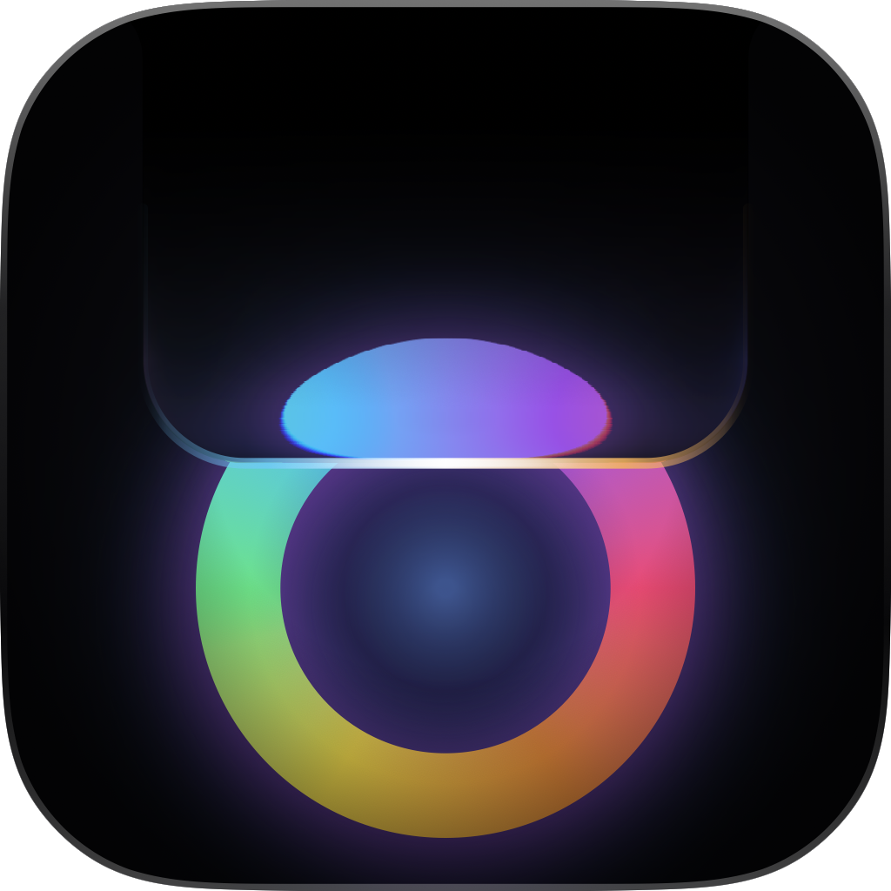

<h1 align="center">
  <br>
  <a href="https://github.com/AllenReder/not-boring-notch"></a>
  <br>
  Not Boring Notch
  <br>
</h1>

<p align="center">
  <em>A heavily modernized, high-performance notch companion for macOS.</em><br>
  <strong>Forked from <a href="https://github.com/TheBoredTeam/boring.notch">TheBoredTeam/boring.notch</a> · Maintained by Allen Yi</strong>
</p>

<p align="center">
  <a href="https://github.com/AllenReder/not-boring-notch/actions/workflows/cicd.yml"></a>
  <a href="LICENSE"></a>
  
  
</p>

---

Say hello to **Not Boring Notch**, the coolest way to make your MacBook’s notch the star of the show! 

Forget about static black cutouts: with Not Boring Notch, your notch transforms into a dynamic control center with native **macOS 26 Liquid Glass optical refraction**, vibrant visualizers, lyrics, calendar integration, a handy file shelf with AirDrop support, sleek system HUD replacements, and upcoming intelligent workflow companions.

<p align="center">
  
</p>

---

## ✨ Features

- 💎 **Liquid Glass Surface**: Native CoreAnimation GPU ray-bending refraction, sub-pixel chromatic dispersion, and crystal-clear transparency with zero blur.
- 🎵 **Media Powerhouse**: Deep integration with Apple Music, Spotify, and YouTube Music. Features real-time lyrics, high-frame-rate spectrogram visualizers, and album art ambient color tinting.
- 📆 **Calendar & Reminders**: Full monthly calendar view, upcoming events, and checkable system Reminders built directly into the notch.
- 📚 **File Shelf**: Drop files into the notch to stage them, quick-look previews, and drag them out anywhere or share via AirDrop.
- 🎚️ **System HUDs**: Sleek Dynamic Island replacements for volume, brightness, backlight, and battery charging animations.
- 🪞 **Notch Mirror & Face**: Built-in camera mirror for quick appearance checks and playful animated notch expressions.

---

## 🚀 Installation

**System Requirements:**
- macOS **14 Sonoma** or later (macOS 26+ for full Liquid Glass hardware refraction)
- Apple Silicon or Intel Mac

### Download from GitHub Releases

1. Download the latest `.dmg` from [**Releases**](https://github.com/AllenReder/not-boring-notch/releases/latest);
2. Open the `.dmg` and drag **Not Boring Notch** into your `/Applications` folder;
3. On first launch, if macOS Gatekeeper prompts an unidentified developer notice, run this command once in Terminal:
   ```bash
   xattr -dr com.apple.quarantine "/Applications/Not Boring Notch.app"
   ```
4. Launch and enjoy!

---

## 🛠️ Building from Source

### Prerequisites

- macOS 15.0 or later
- Xcode 16.0 or later

### Build Instructions

1. Clone the repository:
   ```bash
   git clone https://github.com/AllenReder/not-boring-notch.git
   cd not-boring-notch
   ```

2. Open the project in Xcode:
   ```bash
   open NotBoringNotch.xcodeproj
   ```

3. Press `Cmd + R` to build and run.

---

## 💖 Acknowledgments & Heritage

This project is open-source under the [GNU General Public License v3.0](LICENSE). We gratefully acknowledge the foundations laid by upstream and community projects:

- **[TheBoredTeam/boring.notch](https://github.com/TheBoredTeam/boring.notch)** – The originating open-source project created by Harsh Vardhan Goswami and contributors.
- **[MediaRemoteAdapter](https://github.com/ungive/mediaremote-adapter)** – High-performance Now Playing source for macOS.
- **[NotchDrop](https://github.com/Lakr233/NotchDrop)** – Inspired the initial concept of the shelf drag-and-drop mechanics.
- **[SkyLightWindow](https://github.com/Lakr233/SkyLightWindow)** – macOS SkyLight window management.
